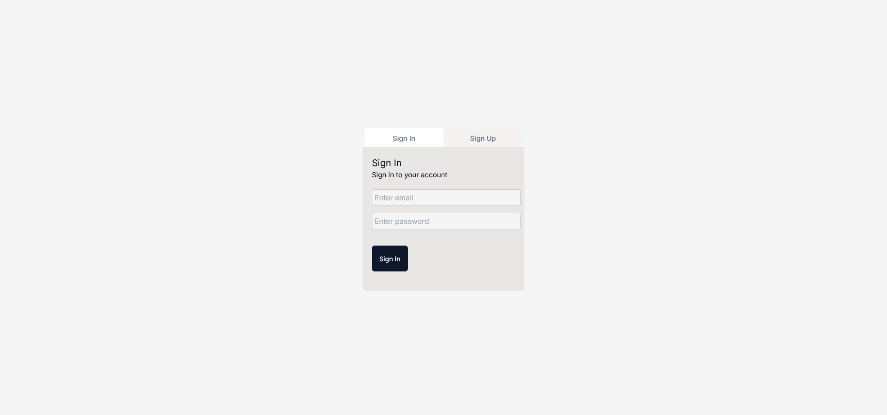
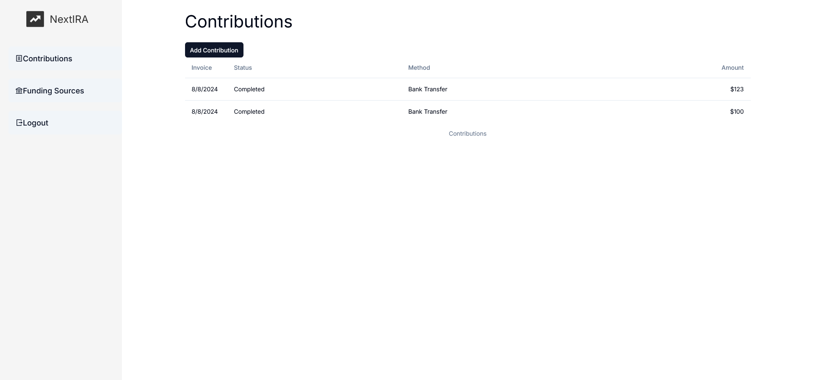
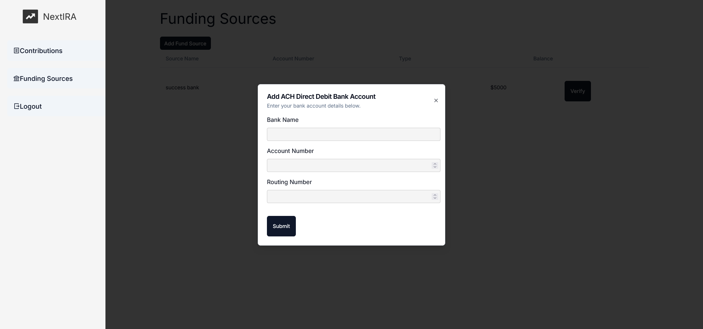
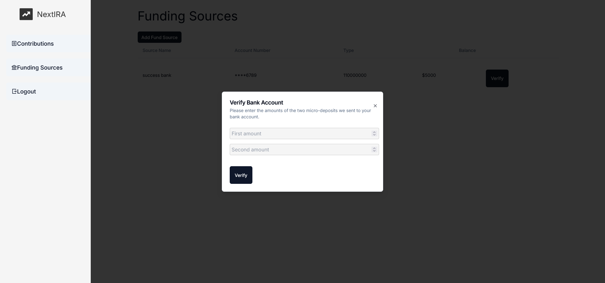
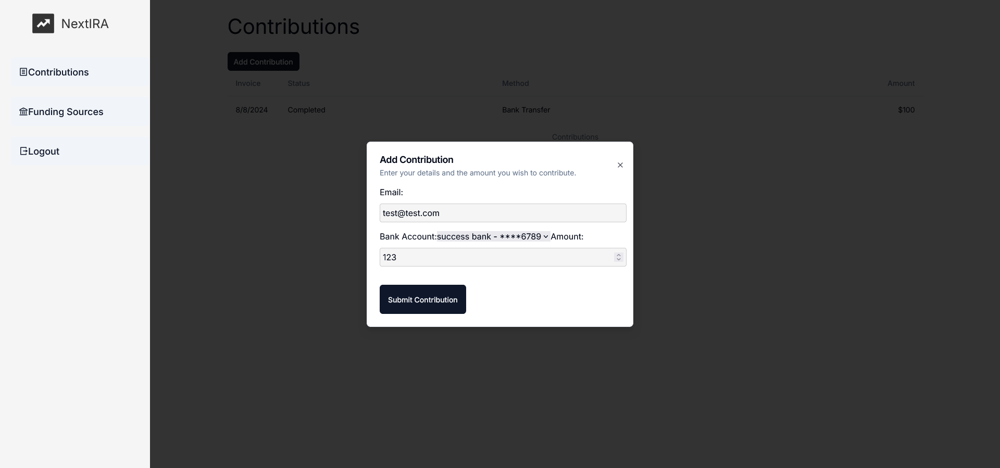

# FundIRA

FundIRA is a web application designed to manage contributions and funding sources through an intuitive dashboard. The application leverages Firebase for authentication and Firestore for data storage, alongside Stripe for payment processing.

## Table of Contents
1. [Features](#features)
2. [Technologies Used](#technologies-used)
3. [Getting Started](#getting-started)
4. [Usage](#usage)
5. [Bugs](#bugs)
6. [Contributing](#contributing)
7. [License](#license)

## Features

- **User Authentication**: Secure user authentication using Firebase.
- **Dashboard**: A user-friendly dashboard to manage contributions and funding sources.
- **Stripe Integration**: Process payments and manage customer bank accounts using Stripe.
- **Firestore Integration**: Store and retrieve user data and contributions using Firestore.
- **Responsive Design**: A responsive UI that works seamlessly on different devices.

## Technologies Used

- **Frontend**:
  - React
  - Firebase Authentication
  - Firebase Firestore
  - Stripe
  - CSS

- **Backend**:
  - Node.js
  - Express
  - Stripe

## Getting Started

### Prerequisites

Ensure you have the following installed:
- Node.js
- npm or yarn

### Installation

1. Clone the repository:
    ```bash
    git clone https://github.com/fernan17893/FundIRA.git
    cd FundIRA
    ```

2. Install dependencies for both frontend and backend:
    ```bash
    cd fundira
    npm install
    ```

3. Set up Firebase:
   - Create a new Firebase project in the [Firebase Console](https://console.firebase.google.com/).
   - Add your Firebase configuration to `firebase.config.js` in the main directory.

4. Set up Stripe:
   - Create a Stripe account and get your API keys from the [Stripe Dashboard](https://dashboard.stripe.com/).
   - Add your Stripe secret key to the backend environment variables.

### Running the Application

1. Start the application:
    ```bash
    npm start

2. Start the backend environment:
    ```bash
    cd src/
    cd app/
    node server.js
    ```

3. Open your browser and navigate to `http://localhost:3000`.

## Usage
- **Login**: Users can log in using their email and password.
        
         test-account: email(test@test.com) password(123456)



- **Dashboard**: Access the dashboard to view and manage contributions and funding sources.



- **Funding Sources**: Add an ACH funding source by clicking Add Fund Sources

        test account: Bank Name(any) 
        Account Number(000123456789)
        Routing Number(110000000) 



- **Micro Deposits**: Before users can add a contribution ACH bank accounts are verified using micro deposits. Click on the verify button to confirm amounts.

        test amounts: .32 and .45


- **Add Contribution**: Users can add contributions through the "Add Contribution" button.


- **Logout**: Users can log out using the "Logout" button.

## Bugs

- **Login Issue**: Occasionally, after entering the user email and password, you may need to reload the page in order to access the dashboard.


## Contributing

- Fork the repository.
- Create a new branch: git checkout -b my-feature-branch.
- Make your changes and commit them: git commit -m 'Add some feature'.
- Push to the branch: git push origin my-feature-branch.
- Submit a pull request.

### License

This project is licensed under the MIT License. See the LICENSE file for details.

